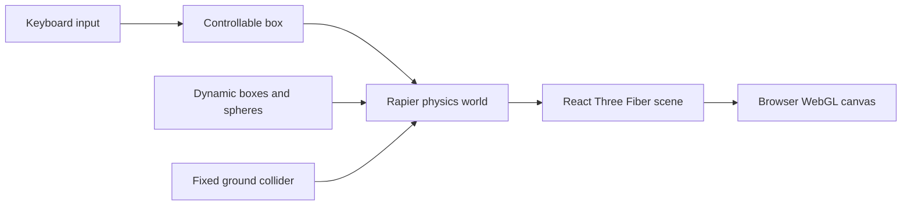

# React Three Physics Playground

<div align="center">


A small browser-based 3D playground for experimenting with React Three Fiber controls and rigid-body physics.

</div>



## Features

- Keyboard-controlled 3D box.
- Dynamic cube and sphere rigid bodies.
- Ground collider, gravity, lighting, and camera controls.
- Next.js client-side scene composition.

## Run

```bash
npm install
npm run dev
```

Open [http://localhost:3000](http://localhost:3000).

## Build

```bash
npm run build
npm start
```

The main experiment lives in `app/components/Scene.tsx`; `app/page.tsx` mounts it into the Next.js application.
